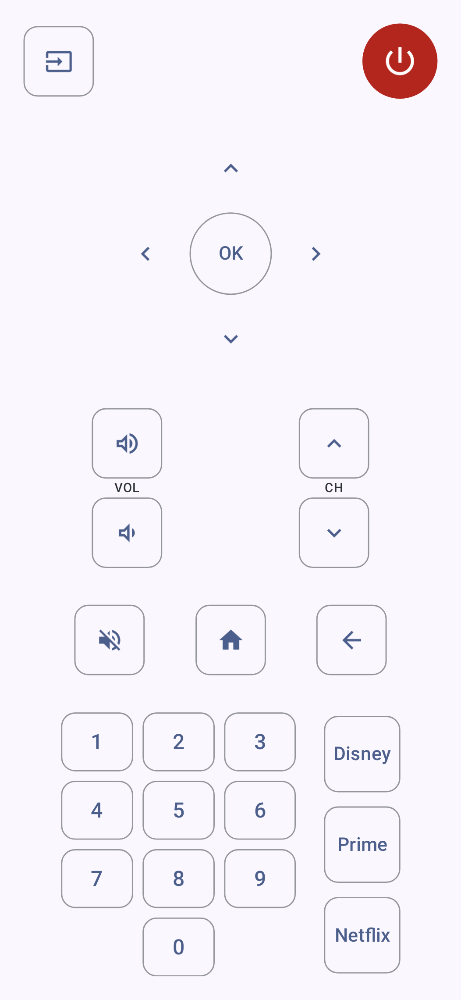

# Unofficial Magic Remote App

A simple, lightweight Android application that turns your phone into a remote control for LG TVs. This app is specifically designed to mimic the functionality of LG Magic Remotes (models MR21GC and MR23GA).
**A phone with IR blaster is required.**

## Features

*   **IR Blaster Support**: Uses your phone's built-in Infrared (IR) blaster to control the TV.
*   **LG Magic Remote Layout**: UI designed to provide familiar controls found on LG Magic Remotes.
*   **Comprehensive Controls**:
    *   **Power & Input**: Turn TV on/off and switch inputs.
    *   **Navigation**: D-Pad for menu navigation (Up, Down, Left, Right, OK).
    *   **Volume & Channel**: Standard volume and channel rockers.
    *   **Media & Apps**: Dedicated buttons for popular streaming services (Disney+, Prime Video, Netflix).
    *   **Numeric Keypad**: Full number pad for channel entry.
    *   **System Controls**: Home, Back, and Mute buttons.
*   **Responsive Design**: Supports both Portrait and Landscape orientations, optimized for various screen sizes.
*   **Dark Mode**: Fully supports system dark theme.

## Tech Stack

*   **Language**: [Kotlin](https://kotlinlang.org/)
*   **UI Toolkit**: [Jetpack Compose](https://developer.android.com/jetbrains/compose) - Modern, declarative UI.
*   **Build System**: Gradle (Kotlin DSL) with Version Catalogs (`libs.versions.toml`).

## Requirements

*   **Hardware**: An Android device with a built-in IR Blaster.
*   **Android Version**: Android 8.0 (API level 26) or higher.

## Permissions

*   `android.permission.TRANSMIT_IR`: Required to use the device's IR transmitter.

## Acknowledgements

*   **IR Codes**: Values for IR signals were sourced from the [Flipper-IRDB repository](https://github.com/logickworkshop/Flipper-IRDB/blob/main/TVs/LG/LG_MR21GC_Magic_Remote.ir).
*   **Development**: Created with the assistance of Gemini.
